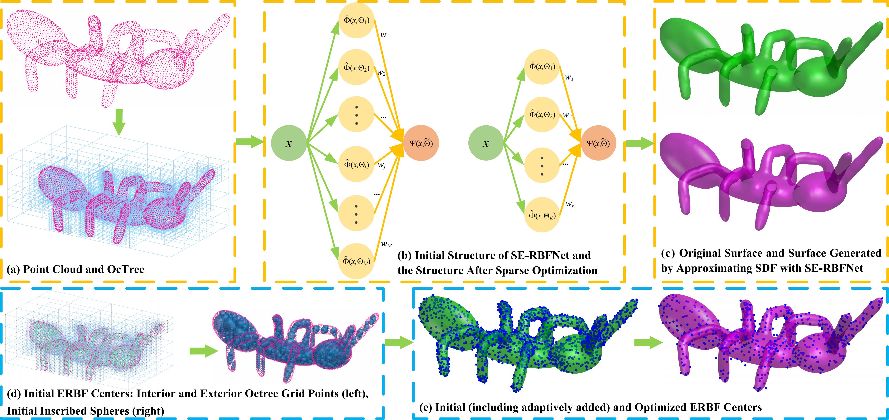

# Approximating Signed Distance Fields of Implicit Surfaces with Sparse Ellipsoidal Radial Basis Function Networks


---

## Instructions for SE-RBFNet (under Linux): 

### 1. Clone the Repository

```bash
git clone https://github.com/lianbobo/SE-RBFNet.git
cd SE-RBFNet
```
#### This repository includes the following folders:

- app/      : Contains executable `.so` files for SE-RBFNet training, Octree construction, and Marching Cubes explicit surface extraction. OCtree-related components are adapted from https://github.com/jsnln/ParametricGaussRecon.git.

- DATA/     : Contains several sample mesh datasets for testing.

- results/  : Output directory for results, including approximated SDFs, constructed Octree data, and explicit surfaces extracted from the approximated SDFs, etc.


### 2. Environment Setup
Before running the main program, install the required Python packages:
```
pip install -r requirements.txt
```
Tested Environment: Python 3.10, CUDA 12.1, Ubuntu 18.04


### 3. Execute main.py. 
- file: Path to the input mesh file (e.g., 'DATA/Armadillo.ply')

- sample_num: Number of points to sample from the mesh (e.g., 40000)

- batch_size: batch size during training (e.g., 10000)

- save_path: Directory to store the output results (e.g., 'results')

- seed: Random seed for reproducibility (e.g., 0)


### 4. Output
Once the script finishes, all results (sampled points, OCtree data, explicit surfaces extracted from the approximated SDFs) will be saved under the results/ directory.


------------------------------------------------------------------------------------------------------------------------
#### Contact
If you encounter any issues running this project, feel free to contact: \
Dr. Bobo Lian \
email: 20244007006@stu.suda.edu.cn
   
